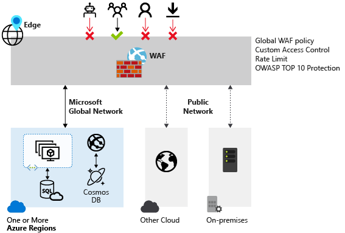

# Introduction

**What is Azure Web Application Firewall?**

Web Application Firewall (WAF) provides centralized protection of your web applications from common exploits and vulnerabilities. Web applications increasingly encounter malicious attacks that exploit commonly known vulnerabilities. SQL injection and cross-site scripting are among the most common attacks.

Preventing such attacks in application code is challenging. It can require rigorous maintenance, patching, and monitoring at multiple layers of the application topology. A centralized web application firewall helps make security management simpler. A WAF also gives application administrators better assurance of protection against threats and intrusions.

A WAF solution can react to a security threat faster by centrally patching a known vulnerability, instead of securing each individual web application.

## Supported service

WAF can be deployed with Azure Application Gateway, Azure Front Door, and Azure Content Delivery Network (CDN) service from Microsoft. WAF on Azure CDN is currently under public preview. WAF has features that are customized for each specific service. For more information about WAF features for each service, see the overview for each service.

Next Section: [Application Gateway WAF](../section-2/2-appGW_WAF.md)  
