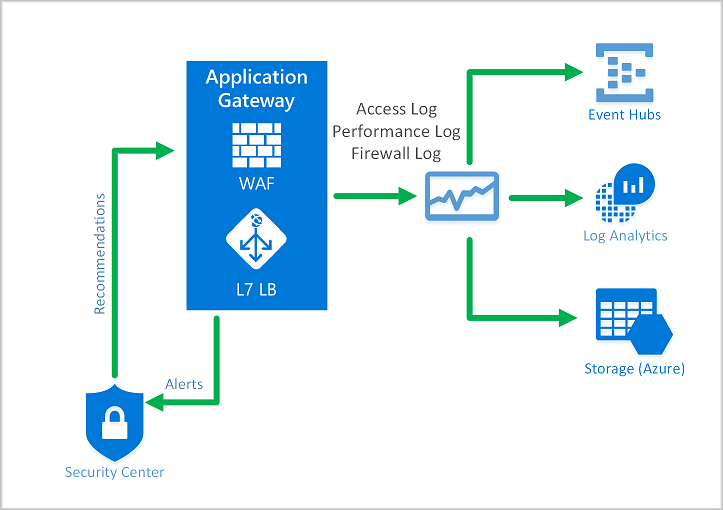

# What is Azure Web Application Firewall on Azure Application Gateway?

The Azure Web Application Firewall (WAF) on Azure Application Gateway actively safeguards your web applications against common exploits and vulnerabilities. Web applications are frequent targets for malicious attacks, these attacks often exploit well-known vulnerabilities such as SQL injection and cross-site scripting.

WAF on Application Gateway is based on the [Core Rule Set (CRS)](https://learn.microsoft.com/en-us/azure/web-application-firewall/ag/application-gateway-crs-rulegroups-rules) from the Open Web Application Security Project (OWASP).

All of the following WAF features exist inside of a WAF policy. You can create **multiple** policies and associate them with:  

- an Application Gateway
- to individual listeners
- or path-based routing rules on an Application Gateway

This enables you to define **separate policies** for **each site** behind your Application Gateway.

> Application Gateway has two versions of the WAF SKU: Application Gateway WAF_v1 and Application Gateway WAF_v2. WAF policy associations are only supported for the Application Gateway WAF_v2 SKU.


## Benefits

This section describes the core benefits that WAF on Application Gateway provides.

## Protection

- Protect your web applications from web vulnerabilities and attacks without modification to back-end code
- Protect multiple web applications at the same time. An instance of Application Gateway can host up to 40 websites that are protected by a web application firewall
- Create custom WAF policies for different sites behind the same WAF
- Protect your web applications from malicious bots with the IP Reputation ruleset.
- Protect your application against DDoS attacks

## Monitoring

Monitor attacks against your web applications by using a real-time WAF log. The log is integrated with Azure Monitor to track WAF alerts and easily monitor trends.

The Application Gateway WAF is integrated with Microsoft Defender for Cloud. Defender for Cloud provides a central view of the security state of all your Azure, hybrid, and multi-cloud resources.

## Customisation

- Customize WAF rules and rule groups to suit your application requirements and eliminate false positives
- Associate a WAF Policy for each site behind your WAF to allow for site-specific configuration
- Create custom rules to suit the needs of your application

## Features

- SQL injection protection
- Cross-site scripting protection
- Protection against other common web attacks, such as command injection, HTTP request smuggling, HTTP response splitting, and remote file inclusion
- Protection against HTTP protocol violations
- Protection against HTTP protocol anomalies, such as missing host user-agent and accept headers
- Protection against crawlers and scanners
- Detection of common application misconfigurations (for example, Apache and IIS)
- Configurable request size limits with lower and upper bounds
- Exclusion lists let you omit certain request attributes from a WAF evaluation. A common example is Active Directory-inserted tokens that are used for authentication or password fields
- Create custom rules to suit the specific needs of your applications
- Geo-filter traffic to allow or block certain countries/regions from gaining access to your applications
- Protect your applications from bots with the bot mitigation ruleset
- Inspect JSON and XML in the request body

## WAF policy and rules

To enable a Web Application Firewall on Application Gateway, you must **create a WAF policy**.

This policy is where all of the:

- managed rules
- custom rules
- exclusions
- and other customisations such as file upload limit exist.

You can configure a WAF policy and associate that policy to one or more application gateways for protection.

A WAF policy consists of two types of security rules:

- Custom rules that you create
- Managed rule sets that are a collection of Azure-managed preconfigured set of rules

When both are present, **custom rules are processed before processing the rules in a managed rule set**.

A rule is made of:

- a match condition
- a priority
- an action (Action types supported are: ALLOW, BLOCK, and LOG)

 You can create a fully customized policy that meets your specific application protection requirements by combining managed and custom rules.

## Rule Processing Priorities

Rules within a policy are processed in a priority order. **Priority** is a unique integer that defines the order of rules to process. **Smaller integer value denotes a higher priority** and those rules are evaluated before rules with a higher integer value.  
Once a rule is matched, the corresponding action that was defined in the rule is applied to the request. Once such a match is processed, rules with lower priorities aren't processed further.

## WAF Associations

A web application delivered by Application Gateway can have a WAF policy associated to it at:

- the `global` level
- at a `per-site` level
- or at a `per-URI` level

## Core rule sets

Application Gateway supports multiple rule sets, including `CRS 3.2`, `CRS 3.1`, and `CRS 3.0`. These rules protect your web applications from malicious activity. For more information, check out [Web Application Firewall DRS and CRS rule groups and rules.](https://learn.microsoft.com/en-us/azure/web-application-firewall/ag/application-gateway-crs-rulegroups-rules)

## Custom rules

Application Gateway also supports custom rules.  

With custom rules, you can create your own rules, which are evaluated for each request that passes through WAF.

> These rules hold a higher priority than the rest of the rules in the managed rule sets.

If a set of conditions is met, an action is taken to **allow** or **block**. For more information on custom rules, see [Custom rules for Application Gateway.](https://learn.microsoft.com/en-us/azure/web-application-firewall/ag/custom-waf-rules-overview)

There is a geo-match operator available for custom rules. See [Geo-match custom rules](https://learn.microsoft.com/en-us/azure/web-application-firewall/ag/custom-waf-rules-overview#geomatch-custom-rules) for more information.

## Bot protection rule set

You can enable a managed bot protection rule set to take custom actions on requests from all bot categories.

Three bot categories are supported:

- **Bad**
  
  Bad bots are bots with:
  - malicious IP addresses
  - bots that have falsified their identities.

Bad bots include malicious IP addresses that are sourced from the **Microsoft Threat Intelligence** feed’s **high confidence** IP Indicators of Compromise and IP reputation feeds. Bad bots also include bots that identify themselves as good bots but their _IP addresses don’t belong to legitimate bot publishers_.

- **Good**

  Good Bots are trusted user agents. Good bot rules are categorized into multiple categories to provide granular control over WAF policy configuration. These categories include:
  - verified search engine bots (such as Googlebot and Bingbot)
  - validated link checker bots
  - verified social media bots (such as Facebookbot and LinkedInBot)
  - verified advertising bots
  - verified content checker bots
  - validated miscellaneous bots

- **Unknown**

Unknown bots are user agents without additional validation. Unknown bots also include malicious IP addresses that are sourced from **Microsoft Threat Intelligence** feed’s **medium confidence** IP Indicators of Compromise.

The WAF platform actively manages and dynamically updates the bot signatures.

When Bot protection is enabled, it **blocks**, **allows**, or **logs** incoming requests that match bot rules based on the configured action.  
It blocks malicious bots, allows verified search engine crawlers, blocks unknown search engine crawlers, and logs unknown bots by default.  

You can set custom actions of different types of bots to:

- block
- allow
- log

You can access WAF logs from a storage account, event hub, log analytics, or send logs to a partner solution.

For more information about Application Gateway bot protection, check out [Web Application Firewall on Application Gateway bot protection.](https://learn.microsoft.com/en-us/azure/web-application-firewall/ag/bot-protection-overview)

## WAF modes

- `Detection mode`: Monitors and logs all threat alerts. You turn on logging diagnostics for Application Gateway in the _Diagnostics section_. You must also _make sure that the WAF log is selected and turned on_.
  > Web application firewall doesn't block incoming requests when it's operating in Detection mode.
- `Prevention mode`: Blocks intrusions and attacks that the rules detect. The attacker receives a "403 unauthorized access" exception, and the connection is closed. Prevention mode records such attacks in the WAF logs.

## WAF engine

The **Web Application Firewall (WAF)** engine is the component that inspects traffic and detects whether a request contains a signature indicating a potential attack. When you use **CRS 3.2 or later**, your Web Application Firewall runs the new WAF engine, which gives you higher performance and an improved set of features. When you use earlier versions of the CRS, your WAF runs on an older engine.

## WAF actions

You can choose which action is run when a request matches a rule condition. The following actions are supported:

- `Allow`: Request passes through the WAF and is forwarded to the back-end. _No further lower priority rules can block this request._
  > Allow actions are only applicable to the Bot Manager ruleset, and aren't applicable to the Core Rule Set.
- `Block`: The request is blocked and WAF sends a response to the client without forwarding the request to the back-end.
- `Log`: Request is logged in the WAF logs and **WAF continues evaluating lower priority rules**.
- `Anomaly score`: The _default action for CRS ruleset_ where total anomaly score is incremented when a rule with this action is matched.
  > Anomaly scoring isn't applicable for the Bot Manager ruleset.

## Anomaly Scoring mode

OWASP has two modes for deciding whether to block traffic:

- `Traditional mode`
- `Anomaly Scoring mode`

In **Traditional mode**, traffic that matches any rule is considered independently of any other rule matches. This mode is easy to understand. But the lack of information about how many rules match a specific request is a limitation. So, Anomaly Scoring mode was introduced. **It's the default for OWASP 3.x.**

In **Anomaly Scoring mode**, traffic that matches any rule isn't immediately blocked when the firewall is in Prevention mode. Rules have a certain severity:

- Critical
- Error
- Warning
- Notice

That severity affects a numeric value for the request, which is called the **Anomaly Score**. For example, one Warning rule match contributes `3` to the score. One Critical rule match contributes `5`.

| Severity | Value |
|----------|-------|
| Critical | 5     |
| Error    | 4     |
| Warning  | 3     |
| Notice   | 2     |

**There's a threshold of 5 for the Anomaly Score to block traffic.** So, a single Critical rule match is enough for the Application Gateway WAF to block a request in Prevention mode. But one Warning rule match only increases the Anomaly Score by 3, which isn't enough by itself to block the traffic.

## Configuration

You can configure and deploy all WAF policies using the Azure portal, REST APIs, Azure Resource Manager templates, Terraform and Azure PowerShell. You can also configure and manage Azure WAF policies at scale using Firewall Manager integration. For more information, checkout [Configure WAF policies using Azure Firewall Manager.](https://learn.microsoft.com/en-us/azure/web-application-firewall/shared/manage-policies)

## WAF monitoring

Monitoring the health of your application gateway is important and can be achieved by integrating your WAF and the applications it protects with Microsoft Defender for Cloud, Azure Monitor, and Azure Monitor logs.



### Azure Monitor

Application Gateway logs are integrated with Azure Monitor, enabling you to track diagnostic information, including WAF alerts and logs. You can access this capability on the **Diagnostics tab** of the Application Gateway resource in the Azure portal or directly through Azure Monitor. To learn more about enabling logs, check out [Diagnostic logs for Application Gateway.](https://learn.microsoft.com/en-us/azure/application-gateway/application-gateway-diagnostics)

### Microsoft Defender for Cloud

Defender for Cloud helps prevent, detect, and respond to threats. It provides increased visibility into and control over the security of your Azure resources. Application Gateway is integrated with Defender for Cloud. Defender for Cloud scans your environment to detect unprotected web applications. It can recommend Application Gateway WAF to protect these vulnerable resources. You create the firewalls directly from Defender for Cloud. These WAF instances are integrated with Defender for Cloud. They send alerts and health information to Defender for Cloud for reporting.

### Microsoft Sentinel

Microsoft Sentinel is a scalable, cloud-native, security information event management (SIEM) and security orchestration automated response (SOAR) solution. Microsoft Sentinel delivers intelligent security analytics and threat intelligence across the enterprise, providing a single solution for alert detection, threat visibility, proactive hunting, and threat response.

With the built-in Azure WAF firewall events workbook, you can get an overview of the security events on your WAF, including events, matched and blocked rules, and all other logged firewall activity.

### Azure Monitor Workbook for WAF

Azure Monitor Workbook for WAF enables custom visualization of security-relevant WAF events across several filterable panels. It works with all WAF types, including Application Gateway, Front Door, and CDN, and it can be filtered based on WAF type or a specific WAF instance. Import via ARM Template or Gallery Template. To deploy this workbook, check out [WAF Workbook.](https://aka.ms/AzWAFworkbook)

## Logging

Application Gateway WAF provides detailed reporting on each threat that it detects.
> Logging is integrated with Azure Diagnostics logs. Alerts are recorded in JSON format. These logs can be integrated with Azure Monitor logs.

```json
{
  "resourceId": "/SUBSCRIPTIONS/{subscriptionId}/RESOURCEGROUPS/{resourceGroupId}/PROVIDERS/MICROSOFT.NETWORK/APPLICATIONGATEWAYS/{appGatewayName}",
  "operationName": "ApplicationGatewayFirewall",
  "time": "2025-05-20T15:52:09.1494499Z",
  "category": "ApplicationGatewayFirewallLog",
  "properties": {
    {
      "instanceId": "ApplicationGatewayRole_IN_0",
      "clientIp": "203.0.34.12",
      "clientPort": "0",
      "requestUri": "/",
      "ruleSetType": "OWASP",
      "ruleSetVersion": "3.0",
      "ruleId": "920350",
      "ruleGroup": "920-PROTOCOL-ENFORCEMENT",
      "message": "Host header is a numeric IP address",
      "action": "Matched",
      "site": "Global",
      "details": {
        "message": "Warning. Pattern match \"^[\\\\d.:]+$\" at REQUEST_HEADERS:Host ....",
        "data": "127.0.0.1",
        "file": "rules/REQUEST-920-PROTOCOL-ENFORCEMENT.conf",
        "line": "791"
      },
      "hostname": "127.0.0.1",
      "transactionId": "16861477007022634343",
      "policyId": "/subscriptions/aaaa0a0a-bb1b-cc2c-dd3d-eeeeee4e4e4e/resourceGroups/drewRG/providers/Microsoft.Network/ApplicationGatewayWebApplicationFirewallPolicies/globalWafPolicy",
      "policyScope": "Global",
      "policyScopeName": " Global "
    }
  }
}
```

Next Section: [FrontDoor WAF](../section-3/3-frontDoor-WAF.md)
Previous Section: [Introduction](../section-1/1-intro.md)
