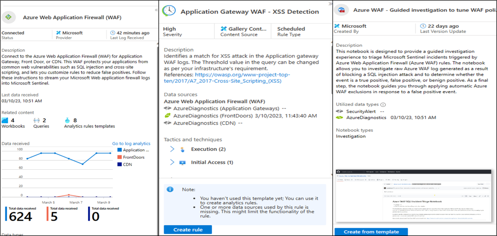

# Introduction to Azure Web Application Firewall

Reference to the course: [Microsoft Learn](https://learn.microsoft.com/en-us/training/modules/introduction-azure-web-application-firewall/)

## Objectives

Describe how Azure Web Application Firewall protects Azure web applications from common attacks, including the features, how it's deployed, and common use cases.

- Explain how Azure Web Application Firewall works to protect Azure web apps from known threats.
- Evaluate whether Azure Web Application Firewall is the right solution to protect your Azure web apps from malicious exploits.
- Identify and describe use cases for Azure Web Application Firewall.

## Unit 1: Introduction

Azure Web Application Firewall is an Azure service that protects web applications from common attacks such as SQL injection and cross-site scripting. The protection extends beyond OWASP (Open Worldwide Application Security Project) top 10 attacks. It can also detect malicious bot attacks, API attacks, and application layer DDoS attacks.

## Unit 2: What is Azure Web Application Firewall?

### Overview of Azure Web Application Firewall

Tests have indicated that bots or malicious actors probe new web apps for weaknesses within minutes of deployment. If you put an app on the web, assume that threat actors will test the app for vulnerabilities almost immediately. You can also assume such probes will continue for the lifetime of the app.

Most malicious tests of web apps check for the presence of one or more common vulnerabilities. If found, a threat actor could use these vulnerabilities to run attacks like the following exploits:

- SQL injection
- Cross-site scripting
- Broken authentication
- Sensitive data exposure
- XML external entities
- Broken access control
- Security misconfiguration
- Insecure deserialization
- Vulnerable components
- Insufficient logging

A common task in the web app development cycle involves writing code to close the most common security holes. Writing the security code requires time, expertise, and testing.

Azure Web Application Firewall is an Azure service that provides centralized protection of Azure-hosted web apps. Azure Web Application Firewall protects web apps from common threats such as SQL injection and cross-site scripting.

You can deploy Azure Web Application Firewall in minutes. Your web apps immediately get powerful protection from known threats, all without writing a single line of security code.

### Key features of Azure Web Application Firewall

To help you evaluate Azure Web Application Firewall, here are some of its important features:

- **Managed rules**: Microsoft's security team creates, maintains, and updates the rules that Azure Web Application Firewall uses to detect and prevent common exploits. If a rule changes, or a rule set (refer to the following description) is modified, Microsoft updates Azure Web Application Firewall automatically and seamlessly.

> You can't modify or delete the managed rules offered by Azure Web Application Firewall. However, if a particular rule is problematic for your environment (for example, it blocks legitimate traffic to your web app) you can create exclusions or disable the rule or rule set. You can also create custom rules to overwrite the default behaviour.

- **Bot rules**: The bot rules identify good bots and protect from bad bots. Bad bots are detected based on Microsoft Threat Intelligence.
- **Custom rules**: If the managed rules offered by Azure Web Application Firewall don't cover a specific threat to your web application, you can create a custom rule.
- **Modes**: Azure Web Application Firewall can operate in one of two modes. **Detection mode** only logs requests that violate a rule, while **prevention mode** both logs and blocks requests that violate a rule.
- **Exclusion lists**: You can configure Azure Web Application Firewall to ignore specific attributes when it checks requests.
- **Policies**: You can combine a set of **managed rules**, **custom rules**, **exclusions**, and other Azure Web Application Firewall settings into a single element called an Azure Web Application Firewall policy. You can then apply that policy to multiple web apps for easy management and maintenance.
- **Request size limits**: You can configure Azure Web Application Firewall to flag requests that are either too small or too large.
- **Alerts**: Azure Web Application Firewall integrates with Azure Monitor. This integration gives you near-real-time alerts when the WAF (Web Application Firewall) detects a threat.

### Common attacks prevented by Azure Web Application Firewall

The following table describes the most common types of malicious threats that Azure Web Application Firewall helps protect against.

| Threat                   | Description                                                                                                                                                                                                                                                                                                                                         |
|--------------------------|-----------------------------------------------------------------------------------------------------------------------------------------------------------------------------------------------------------------------------------------------------------------------------------------------------------------------------------------------------|
| Cross-site scripting     | A threat actor uses a web application to send malicious code to another user's web browser. The browser runs the code, which gives the script access to the user's session data, cookies, and other sensitive information.                                                                                                                          |
| Local file inclusion     | An attacker exploits vulnerabilities in a server's handling of include statements, most often in PHP scripts. By passing specially configured text to a script's include statement, the attacker can include files that are locally present on the server. The attacker might then be able to access sensitive information and run server commands. |
| PHP injection            | The attacker inserts text specially configured to trick the server into running PHP commands. These commands let the attacker run local or remote PHP code. The attacker might then be able to access sensitive data and run commands on the server.                                                                                                |
| Protocol attacks         | An attacker inserts specially configured text into an HTTP/HTTPS request header. Depending on the specific text injected into the header, the attacker can deceive the server into displaying sensitive data or running code.                                                                                                                       |
| Remote command execution | The attacker tricks a server into running commands associated with the server's operating system. On a UNIX system, for example, the attacker might have the server run ls to get a directory listing.                                                                                                                                              |
| Remote file inclusion    | The same as local file inclusion, except the attacker sends the server specially configured text that passes a remote file—that is, a file on a remote server controlled by the attacker—to a script's include statement.                                                                                                                           |
| Session fixation         | An attacker exploits a web app vulnerability that allows the attacker to obtain a valid session ID. The attacker deceives a user into authenticating a new session with that ID. The attacker then hijacks this user-validated session.                                                                                                             |
| SQL injection            | In a web form field, the attacker inserts (or "injects") text specially configured to trick the server into running SQL commands. These commands allow the attacker to access sensitive data, insert, update, or delete data, or run SQL operations.                                                                                                |

Azure Web Application Firewall is designed to prevent these attacks and many more, therefore not having a reliance on writing code that checks for and sanitises these exploits, as it would be difficult and time consuming.

### Sanitizing input

The threats faced by modern web apps are varied and sophisticated. However, in most cases the reason **exploits are possible is that the web app implicitly trusts the input it receives.**

For example, consider a web form that lets an authorized web app user sign in to the user's account. The form consists of just three elements:

- A **Username** text box
- A **Password** text box
- A **Sign In** button

When an authorized user fills in the form and selects Sign In, a web app script stores the username and password in variables. Suppose those variables are named `userName` and `userPassword`, respectively. The script would then execute the following statement:

`sql = "SELECT * FROM users WHERE username='" + userName + "' AND password='" + userPassword + "'"`

For example, if the username is `support` and the password is `1234ABCD`, then the sql variable has the following value:

`SELECT * FROM users WHERE username='support' AND password='1234ABCD'`

The web app executes this SQL statement. If a record is returned from the query, the web app signs the user in.

Now suppose that an attacker enters `admin'--` in the Username field and leaves the Password field blank. In this case, here's the resulting SQL statement:

`SELECT * FROM users WHERE username='admin'--' AND password=''`

On many SQL systems, the double dashes (`--`) mark the start of a comment. Everything after `--` is ignored, so the previous statement is equivalent to the following code:

`SELECT * FROM users WHERE username='admin'`

Assuming there's a user named `admin`, this command signs in the attacker as the admin user; a serious breach!

The preceding example is an instance of an exploit called _SQL injection_. Attackers can take advantage of SQL injection and other exploits in web apps that trust all input.

Azure Web Application Firewall creates a barrier of non-trust between a web app and its user input. Azure Web Application Firewall assumes that all input is potentially malicious, so it sanitises that input.

Sanitising the input means different things depending on the context. For example, sanitising the input can mean removing clearly dangerous text elements, such as SQL comment indicators. However sanitisation occurs, the result is input that can do no harm to the web app or its backend data.

## How Azure Web Application Firewall works

Let's examine how Azure Web Application Firewall works. In particular, let's consider how features such as rule sets and rule groups allow Azure Web Application Firewall to help protect web apps from common exploits. This information helps you evaluate whether Azure Web Application Firewall is the right solution for you.

### Deployment Options

You can deploy Azure Web Application Firewall as part of an Azure front-end solution for your web apps. **You'll begin by creating an Azure Web Application Firewall policy**, which includes the following settings:

- Which **product integration** you want to use
- Which **managed rule set** you want to use
- Any **custom rules** you want to add
- Which **mode** you want to use

### Microsoft managed rule sets, rule groups, and rules

**Azure Web Application Firewall thwarts known exploits by applying rules to an app's incoming HTTP/HTTPS requests.** A rule is a firewall code designed to recognize and prevent a particular threat.

The rules that Azure Web Application Firewall uses to detect and block common vulnerabilities are mostly managed rules that belong to various rule groups.  
Each **rule group** is a collection of **rules**.  
A **managed rule set** is collection of **rule groups**.  
**Managed rule sets** include **Microsoft Threat Intelligence** based _rule groups_, **CVE** (Common Vulnerabilities and Exposures) _rule groups_, and **core** _rule groups_ (CRS).

Open Web Application Security Project (OWASP) defines the CRS rules.  
Microsoft's team of security experts codes, maintains, and updates managed rules. The rules are modified or added to as needed. When a managed rule changes, Microsoft updates Azure Web Application Firewall automatically and without app downtime.

The following screenshot shows some of the rules and rule groups in Microsoft Default Rule set 2.1 (DRS2.1). This should give you a sense of the depth of protection offered by Azure Web Application Firewall.

### Bot Rules

Bot rules identify bad bots, good bots, and unknown bots based on Microsoft Threat Intelligence and proprietary WAF rules.

### Custom rules

The managed rules Azure Web Application Firewall offers _might not cover a specific threat_ that your web applications are experiencing. If so, you can create a custom rule. You can build custom rules by creating conditions that include the following components:

- **Match type** such as **geo location**, **IP address**, **size**, **string**
- **Match variables** such as `RequestHeader`, `QueryString`, `RequestUri`, `RequestBody`, `Cookies`, or `PostArgs`
- **HTTP/HTTPS request methods** such as `POST` or `PUT`
- **Operators** such as `Equal`, `Contains`, `Regex`, `StartsWith`, `Any`, `EndsWith`
- **An action** such as `Allow`, `Block`, `Log` or `Redirect`

### Geo-filtering

By default, WAF responds to all user requests regardless of location where the request is coming from. In some scenarios, you may want to restrict the access to your web application by countries/regions. The geo-filtering custom rule enables you to define a specific path on your endpoint to either allow or block access from specified countries/regions.  
> The geo-filtering rule uses a two-letter country/region code of interest.

For a geo-filtering rule, a match variable is either `RemoteAddr` or `SocketAddr`.

- `RemoteAddr` is the original client IP address that is usually sent via `X-Forwarded-For` request header.  
- `SocketAddr` is the **source IP address** that WAF sees. If your user is behind a proxy, SocketAddr is often the proxy server address.

> You can combine a GeoMatch condition and a `REQUEST_URI` string match condition to create a path-based geo-filtering rule.  

### IP restriction

Azure Web Application Firewall custom rules control access to web applications by specifying a list of IP addresses or IP address ranges.

The IP restriction custom rule lets you control access to your web applications. It does this by specifying **an IP address or an IP address range** in _Classless Inter-Domain Routing(CIDR) format_.

**By default, your web application is accessible from the Internet.** However, sometimes you want to limit access to clients from a list of known IP address or IP address ranges. You can achieve this by creating an IP matching rule that blocks access to your web app from IP addresses not listed in the custom rule.

### Rate limiting

Azure Web Application Firewall custom rules **support rate limiting** to control access based on matching conditions and the rates of incoming requests.

This custom rule enables you to detect abnormally high levels of traffic and block some types of application layer denial of service attacks. Rate limiting also protects you against clients that have accidentally been misconfigured to send large volumes of requests in a short time period. Rate limit counting duration (_either one minute or five-minute intervals_) defines the custom rule and the rate limit threshold (the maximum number of requests allowed in the rate limit duration).

### Detection mode vs prevention mode

Azure Web Application Firewall can operate in one of two modes. The mode you choose depends on how you want the firewall to deal with incoming HTTP/HTTPS requests that match one of its rules:

- **Detection mode**: Logs the request but allows the request to go through.
- **Prevention mode**: Logs the request but doesn't allow the request to go through.
A common scenario is to run Azure Web Application Firewall in detection mode when you're testing an app. In detection mode, you can check for two types of problems:

- **False positives**: Legitimate requests that the firewall flags as malicious.
- **False negatives**: Malicious requests that the firewall allows.
  
Once the app is ready to be deployed, you switch to prevention mode.

### Using Microsoft Sentinel with Azure WAF

Azure WAF combined with Microsoft Sentinel can provide security information event management for WAF resources. Using Microsoft Sentinel, you can access the WAF data connector to Sentinel using Log Analytics. The WAF workbooks show analytics for WAF on Azure Front Door and WAF on Application Gateway. The WAF analytic rules detect SQL and XSS attacks from AFD and Application Gateway logs. The WAF Notebook allows investigation of SQL injection incidents on Azure Front Door.

## When to use Azure Web Application Firewall

You know what Azure Web Application Firewall is and how it works. Now you need some criteria to help you evaluate whether Azure Web Application Firewall is a suitable choice for your scenario. To help you decide, let's consider the following scenarios:

- You have web apps that contain sensitive or proprietary data
- You have web apps that require users to sign in
- Your web app developers lack security expertise
- Your web app developers have other priorities
- You have web app development budget constraints
- You have web app development time constraints
- Your web app must be built and deployed quickly
- Your web app launch will be high-profile

## You have web apps that contain sensitive or proprietary data
