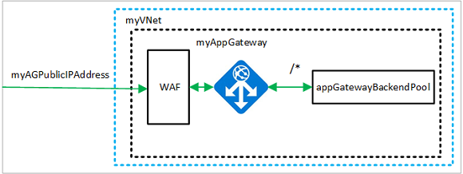

# Create an application gateway with a Web Application Firewall using the Azure portal

This tutorial shows you how to use the Azure portal to create an Application Gateway with a Web Application Firewall (WAF). The WAF uses OWASP rules to protect your application. These rules include protection against attacks such as SQL injection, cross-site scripting attacks, and session hijacks. After creating the application gateway, you test it to make sure it's working correctly. With Azure Application Gateway, you direct your application web traffic to specific resources by assigning listeners to ports, creating rules, and adding resources to a backend pool. For the sake of simplicity, this tutorial uses a simple setup with a public front-end IP, a basic listener to host a single site on this application gateway, two Linux virtual machines used for the backend pool, and a basic request routing rule.

In this tutorial, you learn how to:

- Create an application gateway with WAF enabled
- Create the virtual machines used as backend servers
- Create a storage account and configure diagnostics
- Test the application gateway

